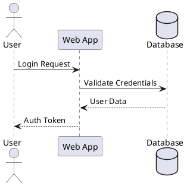
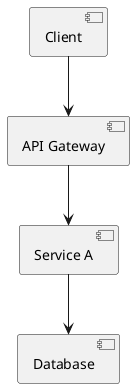
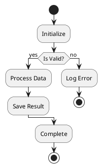
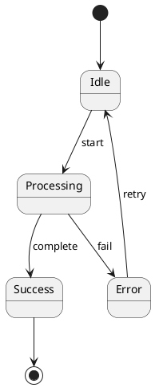

# oh-ascii — Deep Reference

## When to Use

Creating architecture diagrams, file trees, flowcharts, sequence diagrams, box-drawing layouts, blast radius visualizations, swimlane diagrams, or validating ASCII art alignment in documentation. All output renders in monospace terminals.

## Phases

Complete ASCII diagramming — three phases: **Design** (patterns & layout rules), **Generate** (PlantUML workflow), **Validate** (structural alignment checking).

### Phase A: Design Patterns

#### Box-Drawing Characters

Use ONE set per diagram. Never mix.

```
default:   ┌─┐ │ └─┘  ├─┤ ┬ ┴ ┼
emphasis:  ┏━┓ ┃ ┗━┛  ┣━┫ ┳ ┻ ╋
title:     ╔═╗ ║ ╚═╝  ╠═╣ ╦ ╩ ╬
soft:      ╭─╮ │ ╰─╯
portable:  +-+ | +-+  +-+ + + +
arrows:    → ← ↑ ↓ ─> <─ ──> <──
blocks:    █ ▓ ░ ▏▎▍▌▋▊▉
status:    ● ○ ✓ ✗ ⚠ ◆ ◇ ▶ ▷ ↑↓→ ▓▒░
```

| Set | Use |
|-----|-----|
| `default` ─│ | Most diagrams |
| `emphasis` ━┃ | Headers, focus elements |
| `title` ═║ | Section banners only |
| `soft` ╭╮╰╯ ─│ | Status cards, ambient UI |
| `portable` +-\| | CI/TTY fallback |

Status glyphs (closed set): `● ○ ✓ ✗ ⚠ ◆ ◇ ▶ ▷  ↑ ↓ →  ▓ ░ ▒`

#### Diagram Patterns

##### Architecture

```
┌──────────────┐      ┌──────────────┐
│   Frontend   │─────>│   Backend    │
│   React 19   │      │   FastAPI    │
└──────────────┘      └───────┬──────┘
                              v
                      ┌──────────────┐
                      │  PostgreSQL  │
                      └──────────────┘
```

##### File Trees with Annotations

```
src/
├── api/
│   ├── routes.py          [M] +45 -12    !! high-traffic
│   └── schemas.py         [M] +20 -5
├── services/
│   └── billing.py         [A] +180       ** new
└── tests/
    └── test_billing.py    [A] +120       ** new

Legend: [A]dd [M]odify [D]elete  !! Risk  ** New
```

##### Progress Bars, Swimlanes, Blast Radius, Comparisons, Reversibility

**Progress**

```
[████████░░] 80% Complete
+ Design    (2d)   + Backend   (5d)
~ Frontend  (3d)   - Testing   (pending)
```

**Swimlane**

```
Backend  ===[Schema]======[API]===========================[Deploy]====>
                |            |                                ^
                |            +------blocks------+             |
Frontend -------[Wait]--------[Components]=======[Integration]=+

=== active   --- blocked/waiting   | dependency
```

**Blast Radius (Concentric Rings)**

```
            Ring 3: Tests (8 files)
       +-----------------------------------+
       |    Ring 2: Transitive (5)          |
       |   +----------------------------+   |
       |   |  Ring 1: Direct (3)        |   |
       |   |   +------------------+     |   |
       |   |   |   CHANGED FILE   |     |   |
       |   |   +------------------+     |   |
       |   +----------------------------+   |
       +-----------------------------------+
```

**Comparison (Before/After)**

```
BEFORE                          AFTER
┌────────────────┐              ┌────────────────┐
│   Monolith     │              │  Service A     │──┐
│   (all-in-1)   │              └────────────────┘  │  ┌──────────┐
└────────────────┘              ┌────────────────┐  ├─>│  Shared  │
                                │  Service B     │──┘  │  Queue   │
                                └────────────────┘     └──────────┘
```

**Reversibility Timeline**

```
Phase 1  [================]  FULLY REVERSIBLE    (add column)
Phase 2  [================]  FULLY REVERSIBLE    (new endpoint)
Phase 3  [============....]  PARTIALLY           (backfill)
              --- POINT OF NO RETURN ---
Phase 4  [........????????]  IRREVERSIBLE        (drop column)
```

##### Key Rules

- **Font**: Monospace only — box-drawing requires fixed-width
- **Arrows**: `->`, `-->`, or `|` with `v`/`^`
- **Width**: Under 80 cols for terminal compat
- **Nesting**: Max 3 levels
- **Labels**: Short — long text breaks alignment
- **Set consistency**: One set per diagram, never mixed

### Phase B: Generation (PlantUML)

Generate ASCII from `.puml` files. Requires PlantUML installed (`brew install plantuml`, `apt install plantuml`, or `java -jar plantuml.jar`).

#### Workflow

```
plantuml -utxt diagram.puml           # Unicode (preferred)
plantuml -txt diagram.puml             # Standard ASCII
# Output: diagram.utxt or diagram.atxt
```

#### Templates (7 types)

| Type | Description |
|------|------------|
| **Sequence** | Actor → System → DB interactions |
| **Class** | Types, fields, methods, relationships |
| **Activity** | Workflow branches, decision nodes |
| **State** | State transitions, entry/exit, events |
| **Component** | Service boundaries, dependencies |
| **Use Case** | Actors, system boundary, use cases |
| **Deployment** | Nodes, servers, databases, replicas |

**Sequence Example**



**Component Example**



**Activity Example (branching workflows)**



**State Example (state transitions)**



#### CLI Options

```
plantuml -utxt -o ./output diagram.puml    # output dir
plantuml -utxt ./diagrams/                  # batch dir
plantuml -utxt -charset UTF-8 diagram.puml  # charset
```

### Phase C: Validation

Validates structural alignment of box-drawing characters in markdown code blocks. Script bundled at `scripts/check_ascii_alignment.py`.

#### Usage

```bash
python3 scripts/check_ascii_alignment.py docs/ARCHITECTURE.md    # single file
python3 scripts/check_ascii_alignment.py docs/                    # batch dir
python3 scripts/check_ascii_alignment.py docs/ --verbose          # show skipped blocks
python3 scripts/check_ascii_alignment.py docs/ --warn-only        # warnings exit 0
```

#### Checks

- **Vertical alignment** — connectors must match above/below
- **Corner connections** — corners connect to adjacent lines
- **Junction validity** — T-joins/crosses have correct connections
- **Line continuity** — horizontals terminate at valid endpoints
- **Box closure** — no dangling edges

#### Output

Compiler-like format:

```
file.md:45:12: error: vertical connector '|' at col 12 has no match above
  -> Suggestion: Add '|', '├', '┤', '┬', or '┼' at line 44, col 12
```

| Level | Exit |
|-------|------|
| error | 1 |
| warning | 2 (or 0 with --warn-only) |
| info / clean | 0 |

Validation scope: enclosed box diagrams in fenced code blocks. Skips file trees (`├──`). Detects all line weights (light, double, heavy, rounded).

#### Integration

```bash
# Create → validate → fix → re-validate until clean
python3 scripts/check_ascii_alignment.py docs/ARCHITECTURE.md
```

## Anti-patterns

- Mixing character sets in one diagram
- Tabs in diagrams — use spaces; tabs cause false positives
- Deep nesting (4+ levels) — readability degrades past 3
- Over-80-col diagrams — break into sections
- Inline ASCII outside code blocks — always fence
- PlantUML for one-off simple diagrams — manual ASCII is faster for <5 boxes

## Troubleshooting

| Issue | Cause | Fix |
|-------|-------|-----|
| Garbled Unicode | Terminal lacks UTF-8 support | Ensure UTF-8 locale and monospace font |
| Misaligned diagram | Wrong font or tab characters | Fixed-width font (Consolas, Courier, Monaco); convert tabs to spaces |
| PlantUML command not found | Not installed | `java -jar plantuml.jar -txt` as fallback |
| False positives from tabs | Tab characters misalign columns | Convert tabs to spaces before validation |
| Diagram wrong but validator passes | Aesthetic spacing not structural | Validator checks structure, not visual alignment — review manually |
| Validator skipping diagram | Not an enclosed box diagram | Ensure all 4 corners present (`┌┐└┘` or equivalent) |
| Unicode chars not rendering | Terminal font missing glyphs | Use font with full box-drawing support (Cascadia Code, JetBrains Mono) |
