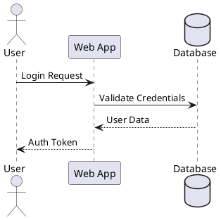
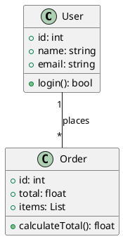
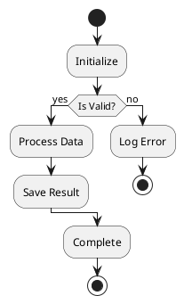
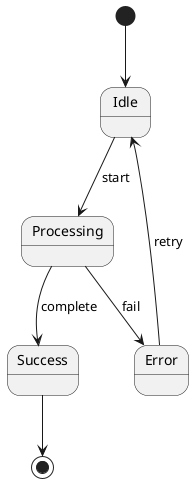
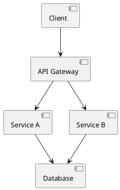
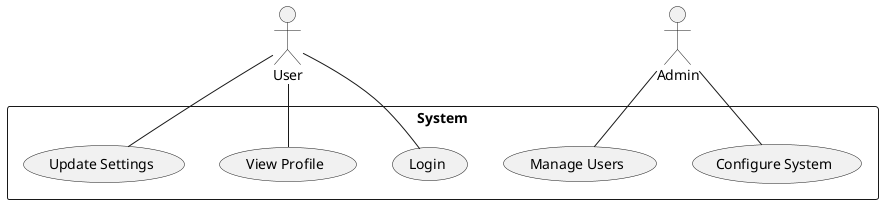
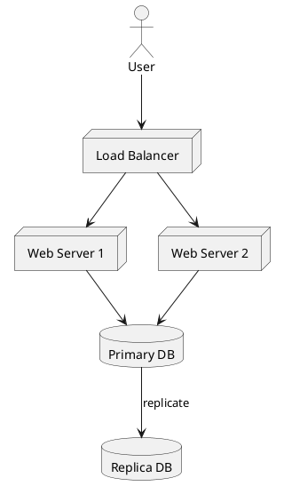

# oh-ascii

Complete ASCII diagramming toolkit — three integrated phases.

- **Design** — pattern catalog, box-drawing character reference, and layout rules
- **Generate** — PlantUML-based workflow for 7 diagram types
- **Validate** — structural alignment checking with actionable error output

All output renders correctly in monospace terminals. Zero guesswork.

---

## When to Use

Load this skill when you need to:

- Create architecture diagrams for README or documentation
- Draw sequence diagrams, class diagrams, or flowcharts as ASCII
- Validate alignment of box-drawing characters in markdown files
- Visualize blast radius, swimlanes, timelines, or progress bars
- Annotate file trees with change metadata
- Build before/after comparison tables
- Track status with progress bars
- Review and fix misaligned ASCII art

---

## Phase A: Design Patterns

### Box-Drawing Character Reference

Use ONE set per diagram. Do not mix sets within a single diagram.

```
default:   ┌─┐ │ └─┘  ├─┤ ┬ ┴ ┼
emphasis:  ┏━┓ ┃ ┗━┛  ┣━┫ ┳ ┻ ╋
title:     ╔═╗ ║ ╚═╝  ╠═╣ ╦ ╩ ╬
soft:      ╭─╮ │ ╰─╯
portable:  +-+ | +-+  +-+ + + +
arrows:    → ← ↑ ↓ ─> <─ ──> <──
blocks:    █ ▓ ░ ▏▎▍▌▋▊▉
status:    ● ○ ✓ ✗ ⚠ ◆ ◇ ▶ ▷ ↑↓→ ▓▒░
```

#### Set Conventions

| Set | Characters | Use For |
|-----|-----------|---------|
| `default` `─│` | Normal boxes and connectors | Most diagrams |
| `emphasis` `━┃` | Headers, focus, draw the eye | Key components, outer frames |
| `title` `═║` | Document titles | Section banners only |
| `soft` `╭╮╰╯ ─│` | Status cards, ambient UI | Diff blocks |
| `portable` `+-\|` | NO_COLOR / CI / bare TTY | Fallback |

#### Status Glyph Vocabulary (Closed Set)

Use only these semantic glyphs. Do not invent alternatives.

```
● ○ ✓ ✗ ⚠ ◆ ◇ ▶ ▷  ↑ ↓ →  ▓ ░ ▒
```

### Diagram Patterns

#### Architecture Diagrams

```
┌──────────────┐      ┌──────────────┐
│   Frontend   │─────>│   Backend    │
│   React 19   │      │   FastAPI    │
└──────────────┘      └───────┬──────┘
                              │
                              v
                      ┌──────────────┐
                      │  PostgreSQL  │
                      └──────────────┘
```

#### File Trees with Annotations

```
src/
├── api/
│   ├── routes.py          [M] +45 -12    !! high-traffic path
│   └── schemas.py         [M] +20 -5
├── services/
│   └── billing.py         [A] +180       ** new file
└── tests/
    └── test_billing.py    [A] +120       ** new file

Legend: [A]dd [M]odify [D]elete  !! Risk  ** New
```

#### Progress Bars

```
[████████░░] 80% Complete
+ Design    (2 days)
+ Backend   (5 days)
~ Frontend  (3 days)
- Testing   (pending)
```

#### Swimlane / Timeline Diagrams

```
Backend  ===[Schema]======[API]===========================[Deploy]====>
                |            |                                ^
                |            +------blocks------+             |
                |                               |             |
Frontend ------[Wait]--------[Components]=======[Integration]=+

=== Active work   --- Blocked/waiting   | Dependency
```

#### Blast Radius (Concentric Rings)

```
            Ring 3: Tests (8 files)
       +-------------------------------+
       |    Ring 2: Transitive (5)      |
       |   +------------------------+   |
       |   |  Ring 1: Direct (3)     |   |
       |   |   +--------------+      |   |
       |   |   | CHANGED FILE |      |   |
       |   |   +--------------+      |   |
       |   +------------------------+   |
       +-------------------------------+
```

#### Comparison Tables (Before/After)

```
BEFORE                          AFTER
┌────────────┐                  ┌────────────┐
│  Monolith  │                  │  Service A │──┐
│  (all-in-1)│                  └────────────┘  │  ┌──────────┐
└────────────┘                  ┌────────────┐  ├─>│  Shared  │
                                │  Service B │──┘  │  Queue   │
                                └────────────┘     └──────────┘
```

#### Reversibility Timeline

```
Phase 1  [================]  FULLY REVERSIBLE    (add column)
Phase 2  [================]  FULLY REVERSIBLE    (new endpoint)
Phase 3  [============....]  PARTIALLY           (backfill)
              --- POINT OF NO RETURN ---
Phase 4  [........????????]  IRREVERSIBLE        (drop column)
```

### Key Rules

| Rule | Description |
|------|-------------|
| Font | Always monospace — box-drawing requires fixed-width |
| Weight | Standard for normal, Heavy for emphasis, Double for titles |
| Arrows | `->`, `-->`, or `|` with `v`/`^` for direction |
| Alignment | Right-pad labels to match column widths |
| Annotations | `!!` for risk, `**` for new, `[A/M/D]` for change type |
| Width | Keep under 80 chars for terminal compatibility |
| Nesting | Max 3 levels of box nesting before readability degrades |
| Set consistency | Use ONE character set per diagram. Never mix. |
| Labels | Short labels only — long text breaks ASCII alignment |

### When to Use Each Pattern

| Pattern | Use Case |
|---------|----------|
| Layered boxes | System architecture, deployment topology |
| Concentric rings | Blast radius, impact analysis |
| Timeline bars | Reversibility, migration phases |
| Swimlanes | Execution order, parallel work streams |
| Annotated trees | File change manifests, directory structures |
| Comparison tables | Cross-layer consistency, before/after |
| Progress bars | Status tracking, completion metrics |

---

## Phase B: Generation (PlantUML)

When you need to generate ASCII diagrams programmatically, PlantUML provides a text-based workflow. These templates work with any PlantUML installation.

### Prerequisites

```bash
# macOS
brew install plantuml

# Ubuntu/Debian
sudo apt-get install plantuml

# JAR (any platform)
# Download from plantuml.com and run:
java -jar plantuml.jar -txt diagram.puml
```

### Generation Workflow

1. Create a `.puml` file with the appropriate diagram template
2. Generate ASCII output:
   ```bash
   # Standard ASCII
   plantuml -txt diagram.puml

   # Unicode box-drawing (preferred — better quality)
   plantuml -utxt diagram.puml
   ```
3. Output is `diagram.atxt` (ASCII) or `diagram.utxt` (Unicode)
4. View with `cat` in a monospace terminal

### Diagram Type Templates

#### Sequence Diagram



ASCII output:
```
┌─────┐        ┌─────┐        ┌─────┐
│ User│        │ App │        │ DB  │
└─────┘        └─────┘        └─────┘
  │  Login Request│              │
  │──────────────>│              │
  │              │Validate Creds │
  │              │──────────────>│
  │              │  User Data    │
  │              │<──────────────│
  │  Auth Token  │              │
  │<─────────────│              │
```

#### Class Diagram



#### Activity Diagram



#### State Diagram



#### Component Diagram



#### Use Case Diagram



#### Deployment Diagram



### CLI Reference

```bash
# Specify output directory
plantuml -txt -o ./output diagram.puml

# Process all files in directory
plantuml -txt ./diagrams/

# Include hidden files
plantuml -txt -includeDot diagrams/

# Verbose output
plantuml -txt -v diagram.puml

# Specify charset
plantuml -txt -charset UTF-8 diagram.puml
```

---

## Phase C: Validation

After creating or editing ASCII diagrams, validate structural alignment of box-drawing characters.

### Quick Start

```bash
# Validate a single markdown file
python3 scripts/check_ascii_alignment.py docs/ARCHITECTURE.md

# Validate all markdown files in a directory
python3 scripts/check_ascii_alignment.py docs/

# Verbose mode (shows skipped blocks)
python3 scripts/check_ascii_alignment.py docs/ --verbose

# Warnings only mode (exit 0 for warnings)
python3 scripts/check_ascii_alignment.py docs/ --warn-only
```

*The script is bundled in `scripts/check_ascii_alignment.py` relative to this skill file.*

### Validation Rules

The script checks code blocks in markdown files for:

1. **Vertical Alignment** — Vertical connectors (`|`, `║`) must align with characters above/below
2. **Corner Connections** — Corners (`┌┐└┘╔╗╚╝┏┓┗┛╭╮╰╯`) must connect properly to adjacent lines
3. **Junction Validity** — T-joins and crosses must have correct incoming/outgoing connections
4. **Line Continuity** — Horizontal lines (`─═━━`) should terminate at valid endpoints
5. **Box Closure** — Boxes should be properly closed (no dangling edges)

### Output Format

Compiler-like format for easy navigation:

```
docs/ARCHITECTURE.md:45:12: error: vertical connector '|' at column 12 has no matching character above
  -> Suggestion: Add '|', '├', '┤', '┬', or '┼' at line 44, column 12

docs/ARCHITECTURE.md:67:8: warning: horizontal line '─' at column 8 has no terminator
  -> Suggestion: Add '┐', '┘', '┤', '┴', or '┼' to close the line
```

### Severity Levels & Exit Codes

| Level | Description | Exit Code |
|-------|-------------|-----------|
| `error` | Broken connections, misaligned verticals | 1 |
| `warning` | Unterminated lines, potential issues | 2 (or 0 with `--warn-only`) |
| `info` | Style suggestions (optional cleanup) | 0 |
| — | No issues found | 0 |

### Scope: What Gets Checked

- Only **enclosed box diagrams** (have corner characters on all four sides)
- Only **fenced code blocks** in markdown files
- Skips **file tree structures** (`├── ` patterns)
- Detects all line weights: light, double, heavy, and rounded

### Integration Workflow

```bash
# 1. Create diagram in markdown
# 2. Validate
python3 scripts/check_ascii_alignment.py docs/ARCHITECTURE.md
# 3. Read error output, fix issues
# 4. Re-validate until clean
python3 scripts/check_ascii_alignment.py docs/ARCHITECTURE.md
# Expected: no alignment issues found
```

---

## Anti-Patterns

- **Mixing character sets** in one diagram — use exactly one set (default/emphasis/title/soft/portable)
- **Long labels** in narrow boxes — keep text short or widen the box
- **Deep nesting** (4+ levels) — readability degrades sharply past 3 levels
- **Over-80-col diagrams** — break into sections for terminal compatibility
- **Mixing file tree patterns with box diagrams** in the same code block — validator handles this, but visually confusing
- **Inline ASCII outside code blocks** — always wrap diagrams in fenced code blocks for validation and rendering
- **Tab characters in diagrams** — convert to spaces; tabs cause false positives in validation
- **Using PlantUML for one-off simple diagrams** — manual ASCII is faster for simple layouts under 5 boxes

---

## Troubleshooting

| Issue | Cause | Solution |
|-------|-------|----------|
| Garbled Unicode characters | Terminal lacks UTF-8 support | Ensure UTF-8 locale and monospace font |
| Diagram looks misaligned | Wrong font or tab characters | Use fixed-width font (Consolas, Courier, Monaco); convert tabs to spaces |
| PlantUML command not found | Not installed | Use the JAR directly: `java -jar plantuml.jar -txt` |
| Validator reports false positives with tabs | Tab characters misalign columns | Convert tabs to spaces before validation |
| Validator finds no issues but diagram looks wrong | Aesthetic spacing not checked | Validator checks structure, not visual spacing — review alignment manually |
| Unicode chars not rendering | Terminal font missing glyphs | Use font with full Unicode box-drawing support (Cascadia Code, JetBrains Mono, etc.) |
| Validator skipping my diagram | Not an enclosed box diagram | Ensure all four corners are present (`┌┐└┘` or equivalent) |

---

## Routing

| Outcome | Route | Reason |
|---------|-------|--------|
| pass | surface | Diagram created or validated, report results |
| fail | surface | Issues found, surface them for manual fix |
| blocker | surface | Cannot proceed, report why |
