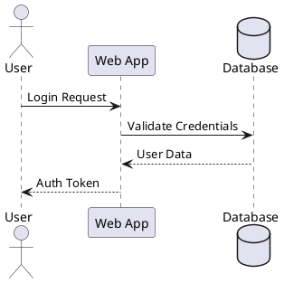
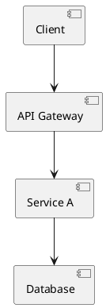
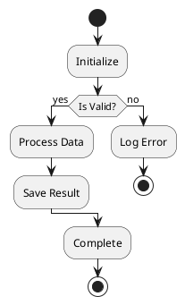
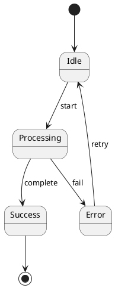

# Phase B: Generation (PlantUML)

Generate ASCII from `.puml` files. Requires PlantUML installed (`brew install plantuml`, `apt install plantuml`, or `java -jar plantuml.jar`).

### Workflow
```
plantuml -utxt diagram.puml           # Unicode (preferred)
plantuml -txt diagram.puml             # Standard ASCII
# Output: diagram.utxt or diagram.atxt
```

### Templates (7 types)

| Type | Description |
|------|------------|
| **Sequence** | Actor → System → DB interactions |
| **Class** | Types, fields, methods, relationships |
| **Activity** | Workflow branches, decision nodes |
| **State** | State transitions, entry/exit, events |
| **Component** | Service boundaries, dependencies |
| **Use Case** | Actors, system boundary, use cases |
| **Deployment** | Nodes, servers, databases, replicas |

#### Sequence Example


#### Component Example


#### Activity Example (branching workflows)


#### State Example (state transitions)


### CLI Options
```
plantuml -utxt -o ./output diagram.puml    # output dir
plantuml -utxt ./diagrams/                  # batch dir
plantuml -utxt -charset UTF-8 diagram.puml  # charset
```
